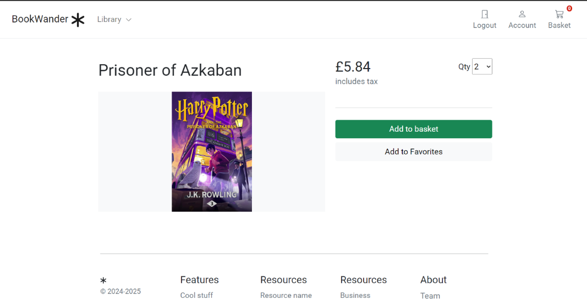

# BookWander

[](https://www.python.org/)
[](https://www.djangoproject.com/)
[](https://www.docker.com/)
[](https://aws.amazon.com/)
[](https://www.elastic.co/)
[](https://redis.io/)
[](https://stripe.com/)
[](https://github.com/features/actions)

## Overview

BookWander is a modern web application that transforms the way users experience books. It offers a seamless platform for discovering, purchasing, and managing eBooks. The application leverages advanced technologies to provide a personalized and efficient book-browsing experience.

## Getting Started

### Landing page


## Features
### Login


### Sign up
**User Authentication**: Secure user registration and login.


### Homepage


### Book details page


### Basket
**Shopping Cart**: Seamless cart management with flexible update options.


### Checkout screen
**Checkout and Payment**: Smooth payment processing using Stripe.


### Order placed


### User Dashboard
**User Profile**: Customizable user profiles with purchase history.


### Book Search
**Book Search**: Advanced search capabilities using Elasticsearch.


## Architecture

The application is built using the following technologies:

- **Backend**: Django, Python
- **Frontend/UI**: HTML, CSS, JavaScript
- **Database**: SQLite
- **Payment Processing**: Stripe

## API Endpoints

Detailed API documentation is available in the [API Documentation](API.md) file.

## Installation

Follow these steps to set up and run the BookWander application:

1. Clone the repository:

    ```bash
    git clone https://github.com/yourusername/BookWander_v0.1.git
    cd BookWander_v0.1

    ```

2. Install dependencies:

    ```bash
    pip install -r requirements.txt
    ```

3. Set up the database:

    ```bash
    python manage.py migrate
    ```

4. Run the development server:

    ```bash
    python manage.py runserver
    ```

5. Run Stripe logs (run in another terminal)

    ```
    .\stripe listen --forward-to localhost:8000/payment/webhook/
    ```

Visit [http://localhost:8000/](http://localhost:8000/) in your browser to access the application.

## Contributing

We welcome contributions! Check out the [Contribution Guidelines](CONTRIBUTING.md) to get started.

## Future
There is a plethora of features that we would love to implement into BookWander in the near future, some of which include:
- Deploying BookWander
- Book Reviews: Ability to rate and review books.
- A user recommendations system
- cache
- Processing or working with images with OpenCv
- Full-text search service like Elasticsearch
- Integrating cloud storage (Amazon S3) to store ebooks
- Database population using Google Books API
- Generating product statistics
- Live Chat

## Authors
- Kobby Boateng: <kobbyboateng14@gmail.com>  - <https://github.com/2oothpick>
- Fatima Zahra El Fatehy <fzelfatehy@gmail.com> -  https://github.com/fatima-elfat
- Oussama Ed-derouach <oussama.ed-derouach@outlook.com> - https://github.com/ED-DEROUACH 

## License

This project is licensed under the [MIT License](LICENSE).
